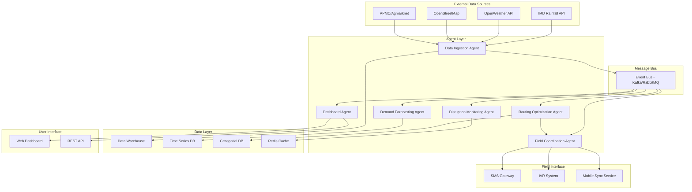
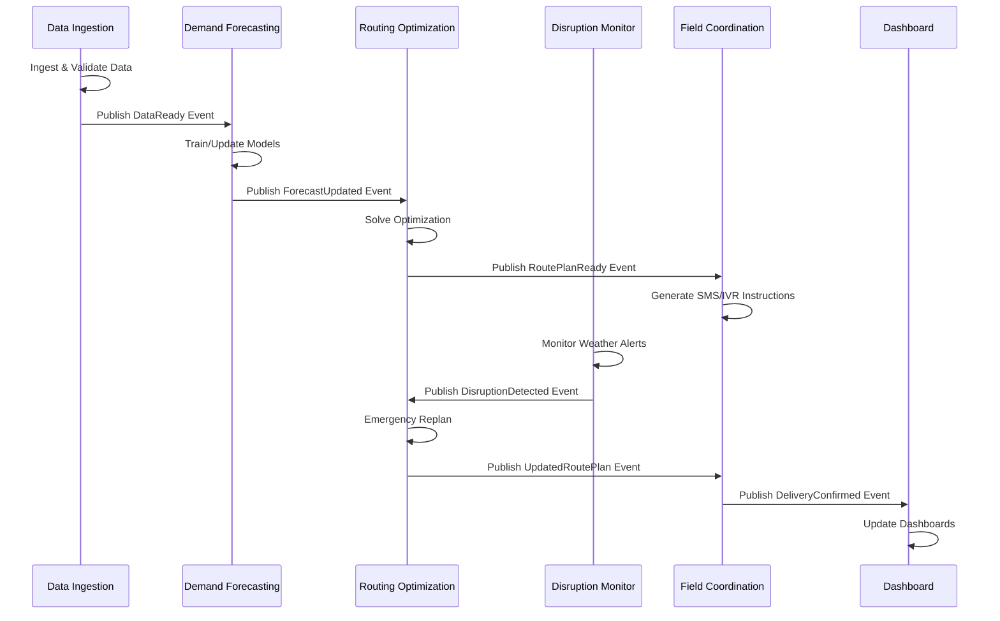

# Design Document: Rural Supply Chain Optimization System

## Overview

This document describes the technical design for a multi-agent AI system that optimizes rural supply-chain distribution in India. The system coordinates six specialized agents to forecast demand, optimize routing, monitor disruptions, and coordinate field operations across low-bandwidth networks.

The architecture follows an event-driven microservices pattern where agents communicate through a message bus, maintain their own data stores, and operate autonomously while coordinating through well-defined interfaces. The system is designed for phased deployment starting with a single-district MVP and scaling to multi-district operations with public sector integration.

## Architecture

### System Architecture Diagram



### Agent Interaction Flow



## Components and Interfaces

### 1. Data Ingestion & Validation Agent

**Responsibilities:**
- Pull data from external APIs on scheduled intervals
- Normalize heterogeneous data formats into internal schema
- Geocode village and depot locations
- Detect and flag data anomalies
- Create versioned data snapshots
- Maintain audit logs

**Key Interfaces:**

```python
class DataIngestionAgent:
    def ingest_weather_data(source: WeatherSource, date_range: DateRange) -> WeatherDataset
    def ingest_road_network(source: RoadSource, region: GeoRegion) -> RoadNetwork
    def ingest_market_data(source: MarketSource, date_range: DateRange) -> MarketDataset
    def geocode_location(address: str) -> Coordinates
    def validate_dataset(dataset: Dataset) -> ValidationReport
    def create_snapshot(dataset: Dataset, metadata: SnapshotMetadata) -> SnapshotID
```

**Data Normalization:**
- Weather data: Convert to standard units (mm rainfall, °C temperature), align timestamps to IST
- Road data: Extract OSM ways, convert to graph representation with edge weights (distance, quality, flood_risk)
- Market data: Normalize prices to INR/quintal, align commodity names to standard taxonomy
- Location data: Store as WGS84 coordinates with administrative hierarchy (state, district, block, village)

**Anomaly Detection:**
- Missing value detection: Flag fields with >20% missing data
- Outlier detection: Use IQR method for numerical fields, flag values >3 IQR from median
- Temporal consistency: Flag timestamps out of sequence or future-dated
- Spatial consistency: Flag coordinates outside India bounding box or in water bodies

**Versioning Strategy:**
- Each snapshot tagged with: source_name, ingestion_timestamp, record_count, schema_version
- Immutable snapshots stored in data warehouse with retention policy (90 days for raw, indefinite for aggregated)
- Delta tracking for incremental updates

### 2. Demand Forecasting Agent

**Responsibilities:**
- Train village-level demand models for each SKU
- Generate forecasts with confidence intervals
- Backtest model performance weekly
- Trigger retraining when accuracy degrades
- Support A/B testing of model variants

**Key Interfaces:**

```python
class DemandForecastingAgent:
    def train_model(village_id: str, sku: str, training_data: TimeSeriesData) -> Model
    def generate_forecast(village_id: str, sku: str, horizon: int) -> ForecastWithCI
    def backtest_model(model: Model, test_data: TimeSeriesData) -> AccuracyMetrics
    def evaluate_trigger_retraining(model: Model, recent_errors: List[float]) -> bool
    def compare_model_variants(models: List[Model], test_data: TimeSeriesData) -> ComparisonReport
```

**Model Architecture:**

The system supports multiple forecasting approaches with configurable selection:

1. **Gradient Boosting (XGBoost/LightGBM):**
   - Features: lagged demand (7, 14, 30 days), rainfall (current + 7-day forecast), crop cycle indicators (binary: sowing/harvest/off-season), festival indicators (binary: 7-day window), day-of-week, month, MSP announcement flags
   - Target: Daily demand per SKU per village
   - Hyperparameters: max_depth=6, learning_rate=0.1, n_estimators=100
   - Confidence intervals: Quantile regression at 10th and 90th percentiles

2. **Temporal Fusion Transformer (TFT):**
   - Static features: village population, distance to nearest mandi, road quality index
   - Time-varying known: rainfall forecast, festival calendar, crop cycle phase
   - Time-varying unknown: historical demand, price fluctuations
   - Attention mechanism: Multi-head attention over 30-day lookback window
   - Confidence intervals: Native probabilistic outputs

3. **Bayesian Hierarchical Model:**
   - Hierarchy: State → District → Block → Village
   - Priors: Weakly informative priors on seasonal effects and trend
   - Sampling: MCMC with 4 chains, 2000 iterations, 1000 warmup
   - Confidence intervals: Posterior predictive distribution

**Model Selection Strategy:**
- Phase 1 MVP: Gradient Boosting (faster training, interpretable)
- Phase 2+: TFT for high-volume villages (>100 transactions/month), Gradient Boosting for low-volume
- Bayesian models for villages with <6 months history (borrow strength from hierarchy)

**Backtesting Protocol:**
- Weekly evaluation on rolling 4-week test window
- Metrics: MAPE (Mean Absolute Percentage Error), RMSE, coverage of 80% prediction intervals
- Retraining trigger: MAPE increases >15% relative to baseline OR prediction interval coverage <70%

**Feature Engineering:**
- Rainfall features: 7-day cumulative, 30-day cumulative, deviation from historical average
- Crop cycle: Binary indicators for kharif sowing (Jun-Jul), kharif harvest (Oct-Nov), rabi sowing (Nov-Dec), rabi harvest (Mar-Apr)
- Festival features: Binary indicators for major festivals (Diwali, Holi, Pongal, Onam) with 7-day lead window
- Market features: Lagged mandi prices (7, 14 days), MSP announcement binary flag

### 3. Network & Routing Optimization Agent

**Responsibilities:**
- Solve stock placement across depots
- Optimize shipment bundling and vehicle routing
- Respect time windows and capacity constraints
- Penalize poor roads and flood-prone segments
- Generate explainable routing decisions

**Key Interfaces:**

```python
class RoutingOptimizationAgent:
    def solve_stock_placement(demand_forecast: Dict[str, float], depots: List[Depot]) -> StockAllocation
    def solve_vehicle_routing(deliveries: List[Delivery], vehicles: List[Vehicle], road_network: RoadNetwork) -> RoutesPlan
    def calculate_route_cost(route: Route, road_network: RoadNetwork) -> RouteCost
    def explain_routing_decision(route: Route) -> Explanation
    def generate_pareto_solutions(problem: OptimizationProblem, objectives: List[Objective]) -> List[Solution]
```

**Optimization Formulation:**

**Stock Placement Problem (Two-Stage Stochastic Programming):**

Minimize:
```
Total_Cost = Σ(depot_holding_cost) + Σ(transportation_cost) + penalty * Σ(expected_stockouts)
```

Subject to:
- Depot capacity constraints: stock[depot, sku] ≤ capacity[depot]
- Demand satisfaction: Σ(shipments to village) ≥ demand[village, sku] - allowed_stockout
- Non-negativity: stock[depot, sku] ≥ 0

**Vehicle Routing Problem with Time Windows (VRP-TW):**

Minimize:
```
Total_Distance = Σ(distance[i,j] * x[i,j,v] * road_quality_penalty[i,j])
```

Subject to:
- Each delivery visited exactly once: Σ(x[i,j,v]) = 1 for all deliveries i
- Vehicle capacity: Σ(demand[i] * x[i,j,v]) ≤ capacity[v]
- Time windows: arrival_time[i] ∈ [earliest[i], latest[i]]
- Flow conservation: Σ(x[i,j,v]) = Σ(x[j,k,v]) for all intermediate nodes j
- Subtour elimination: Miller-Tucker-Zemlin constraints

**Road Quality Penalties:**
- Good paved road: penalty = 1.0 (baseline)
- Poor paved road: penalty = 1.3 (30% time increase)
- Unpaved road: penalty = 1.8 (80% time increase)
- Flood-prone segment (monsoon): penalty = 2.5 (150% time increase + risk)
- Closed road: penalty = ∞ (excluded from solution)

**Solver Selection:**
- Stock placement: Gurobi or CPLEX for MILP (if available), otherwise PuLP with CBC solver
- Vehicle routing: Google OR-Tools VRP solver with local search metaheuristics
- Fallback: Greedy heuristics (nearest neighbor + 2-opt improvement) for real-time replanning

**Multi-Objective Optimization:**

When multiple objectives are specified, use weighted sum approach:
```
Objective = w1 * normalized_cost + w2 * normalized_time + w3 * stockout_risk + w4 * (1 - coverage)
```

Default weights: w1=0.4 (cost), w2=0.3 (time), w3=0.2 (stockout), w4=0.1 (coverage)

For Pareto analysis, solve with varying weights and return non-dominated solutions.

**Explainability:**

For each route, generate explanation:
- "Route serves {N} villages with total distance {D} km"
- "Avoids {road_name} due to {reason: flood risk/poor condition}"
- "Prioritizes {village_name} due to {reason: high stockout risk/time window}"
- "Vehicle utilization: {X}% of capacity"

### 4. Disruption Monitoring Agent

**Responsibilities:**
- Monitor weather alerts and rainfall thresholds
- Detect flood risk for road segments
- Flag road closures from crowdsourced reports
- Trigger emergency replanning workflows
- Log all disruption events

**Key Interfaces:**

```python
class DisruptionMonitoringAgent:
    def monitor_weather_alerts(region: GeoRegion) -> List[WeatherAlert]
    def assess_flood_risk(rainfall: float, road_segment: RoadSegment) -> FloodRisk
    def process_road_report(report: CrowdsourcedReport) -> RoadStatus
    def trigger_emergency_replan(disruption: Disruption) -> ReplanRequest
    def log_disruption_event(event: DisruptionEvent) -> EventID
```

**Flood Risk Assessment:**

Risk score calculated as:
```
flood_risk = rainfall_intensity * drainage_factor * elevation_factor
```

Where:
- rainfall_intensity: mm/hour over last 24 hours
- drainage_factor: 1.0 (good drainage) to 3.0 (poor drainage, based on soil type and slope)
- elevation_factor: 1.0 (high ground) to 2.0 (low-lying areas, flood plains)

Risk thresholds:
- Low (0-5): Normal operations
- Medium (5-10): Monitor closely, add 30% time buffer
- High (10-20): Avoid if alternative exists, add 100% time buffer
- Critical (>20): Mark road as closed

**Rainfall Thresholds:**
- Yellow alert: >64.5 mm in 24 hours → Increase monitoring frequency to 1-hour intervals
- Orange alert: >115.6 mm in 24 hours → Trigger route review, flag high-risk segments
- Red alert: >204.5 mm in 24 hours → Trigger emergency replanning, avoid all medium+ risk segments

**Crowdsourced Report Processing:**

Confidence scoring:
```
confidence = reporter_reliability * corroboration_factor * recency_factor
```

Where:
- reporter_reliability: 0.3 (new reporter) to 1.0 (verified reporter with >10 accurate reports)
- corroboration_factor: 1.0 (single report) to 2.0 (3+ independent reports within 2 hours)
- recency_factor: 1.0 (< 1 hour old) decaying exponentially to 0.3 (> 24 hours old)

Accept report if confidence > 0.6, otherwise flag for manual review.

**Emergency Replanning Trigger:**

Trigger replanning when:
- Any road segment on active routes changes from passable to closed
- Rainfall alert escalates to orange or red in region with active deliveries
- 3+ high-confidence road reports indicate significant delays (>2 hours) on active routes

### 5. Field Coordination Agent

**Responsibilities:**
- Convert route plans to SMS/IVR instructions
- Parse delivery confirmations from field agents
- Support offline data collection and synchronization
- Validate and score crowdsourced reports
- Manage field agent communication workflows

**Key Interfaces:**

```python
class FieldCoordinationAgent:
    def generate_sms_instructions(route: Route, agent: FieldAgent) -> List[SMSMessage]
    def generate_ivr_script(route: Route) -> IVRScript
    def parse_delivery_confirmation(sms: SMSMessage) -> DeliveryConfirmation
    def create_offline_data_packet(route: Route) -> DataPacket
    def sync_offline_reports(packets: List[DataPacket]) -> SyncReport
    def score_crowdsourced_report(report: Report, reporter: Reporter) -> ConfidenceScore
```

**SMS Message Format:**

Route instruction SMS (max 160 characters per message):
```
Route R123: 1.Village_A(SKU1:10,SKU2:5) 2.Village_B(SKU1:8) 3.Village_C(SKU2:12). Start:9AM. Call 1800-XXX for help.
```

Delivery confirmation SMS (from field agent):
```
CONFIRM R123 V1 OK 0945
```
Format: CONFIRM <RouteID> <VillageSeq> <Status> <Time>
Status codes: OK (delivered), PARTIAL (partial delivery), FAIL (not delivered), DELAY (delayed)

Road report SMS:
```
ROAD R123 SEG5 FLOODED
```
Format: ROAD <RouteID> <SegmentID> <Condition>
Condition codes: CLEAR, SLOW, FLOODED, BLOCKED, DAMAGED

**IVR Workflow:**

1. Welcome: "Namaste. Route {RouteID} instructions."
2. For each stop: "Stop {N}: Village {Name}. Deliver {SKU list}. Press 1 when complete."
3. Confirmation: "Delivery confirmed at {Time}. Next stop: {Village}."
4. Report issue: "Press 9 to report road problem."
5. Road report: "Describe road condition after beep. Press # when done."

**Offline Data Packet Structure:**

JSON packet with route details, village list, SKU quantities, maps (base64 encoded), and sync metadata:
```json
{
  "route_id": "R123",
  "agent_id": "A456",
  "villages": [
    {"seq": 1, "name": "Village_A", "lat": 12.34, "lon": 78.90, "deliveries": [{"sku": "SKU1", "qty": 10}]}
  ],
  "map_tiles": ["base64_encoded_tile_1", "base64_encoded_tile_2"],
  "sync_metadata": {"created_at": "2024-01-15T08:00:00Z", "version": "1.0"}
}
```

Packet size optimized for 2G networks (<500 KB), with map tiles pre-cached for offline use.

**Synchronization Protocol:**

1. Field agent downloads packet when connected (WiFi/3G)
2. Operates offline using cached data
3. Records confirmations and reports locally
4. Uploads when connectivity restored (opportunistic sync)
5. Server validates timestamps, deduplicates, and updates system state

### 6. Public System Dashboard Agent

**Responsibilities:**
- Generate dashboards for supply officers and managers
- Produce weekly PDF/HTML reports
- Maintain audit logs of system decisions
- Provide explainable justifications for recommendations
- Support filtering and drill-down analysis

**Key Interfaces:**

```python
class DashboardAgent:
    def generate_dashboard(user_role: Role, filters: DashboardFilters) -> Dashboard
    def generate_weekly_report(date_range: DateRange, region: GeoRegion) -> Report
    def get_audit_log(filters: AuditFilters) -> List[AuditEntry]
    def explain_decision(decision_id: str) -> Explanation
    def export_metrics(metrics: List[Metric], format: ExportFormat) -> File
```

**Dashboard Views:**

1. **Executive Summary (District Supply Officer):**
   - KPI cards: Total cost, stockout rate, vehicle utilization, service coverage
   - Trend charts: Cost per unit delivered (weekly), stockout events (daily), delivery delays (weekly)
   - Map view: Village coverage heatmap, active routes, disruption alerts
   - Alerts: High stockout risk villages, delayed deliveries, system anomalies

2. **Operational View (Cooperative Manager):**
   - Route status: Active routes, completed deliveries, pending confirmations
   - Inventory: Stock levels by depot and SKU, reorder recommendations
   - Performance: On-time delivery rate, vehicle utilization, cost vs budget
   - Field reports: Recent road conditions, delivery issues, agent feedback

3. **Analytics View (Supply Chain Planner):**
   - Forecast accuracy: MAPE by village and SKU, prediction interval coverage
   - Optimization metrics: Solution quality, solver runtime, constraint violations
   - Scenario comparison: Baseline vs optimized, what-if analysis
   - Data quality: Ingestion status, anomaly counts, data freshness

**Report Generation:**

Weekly PDF report structure:
1. Executive summary (1 page): Key metrics, week-over-week changes, highlights
2. Performance analysis (2 pages): Detailed metrics with charts, comparison to baseline
3. Operational insights (2 pages): Top performing routes, problem areas, recommendations
4. Appendix (variable): Detailed tables, audit log excerpts, data quality report

HTML report: Interactive version with drill-down, exportable charts, and data tables.

**Audit Log Schema:**

```json
{
  "event_id": "uuid",
  "timestamp": "ISO8601",
  "agent": "agent_name",
  "event_type": "forecast_generated | route_optimized | disruption_detected | replan_triggered",
  "inputs": {"key": "value"},
  "outputs": {"key": "value"},
  "model_version": "version_string",
  "parameters": {"key": "value"},
  "explanation": "human_readable_text"
}
```

Retention: 1 year for all events, indefinite for major decisions (route plans, replanning events).

## Data Models

### Core Entities

**Village:**
```python
class Village:
    id: str  # Unique identifier
    name: str
    coordinates: Coordinates  # lat, lon
    admin_hierarchy: AdminHierarchy  # state, district, block
    population: int
    road_connectivity: RoadQuality  # GOOD, FAIR, POOR
    nearest_depot_id: str
    distance_to_depot_km: float
```

**Depot:**
```python
class Depot:
    id: str
    name: str
    coordinates: Coordinates
    capacity_cubic_meters: float
    current_stock: Dict[str, float]  # sku_id -> quantity
    operating_hours: TimeWindow
    vehicle_fleet: List[str]  # vehicle_ids
```

**SKU (Stock Keeping Unit):**
```python
class SKU:
    id: str
    name: str
    category: str  # FERTILIZER, SEED, PESTICIDE, EQUIPMENT
    unit: str  # KG, LITER, PIECE
    unit_cost: float  # INR
    shelf_life_days: int
    storage_requirements: str  # DRY, COOL, REFRIGERATED
```

**Vehicle:**
```python
class Vehicle:
    id: str
    type: VehicleType  # TRUCK, TEMPO, TRACTOR
    capacity_cubic_meters: float
    capacity_kg: float
    fuel_efficiency_kmpl: float
    operating_cost_per_km: float
    current_location: Coordinates
    status: VehicleStatus  # AVAILABLE, IN_TRANSIT, MAINTENANCE
```

**RoadSegment:**
```python
class RoadSegment:
    id: str
    start_node: str
    end_node: str
    distance_km: float
    road_quality: RoadQuality  # PAVED_GOOD, PAVED_POOR, UNPAVED, TRACK
    flood_risk_baseline: float  # 0.0 to 1.0
    current_status: RoadStatus  # OPEN, SLOW, CLOSED
    last_updated: datetime
```

**Demand Forecast:**
```python
class DemandForecast:
    village_id: str
    sku_id: str
    forecast_date: date
    predicted_demand: float
    confidence_interval_lower: float  # 10th percentile
    confidence_interval_upper: float  # 90th percentile
    model_version: str
    generated_at: datetime
```

**Route:**
```python
class Route:
    id: str
    vehicle_id: str
    agent_id: str
    depot_id: str
    stops: List[RouteStop]
    total_distance_km: float
    estimated_duration_hours: float
    total_cost: float
    status: RouteStatus  # PLANNED, ACTIVE, COMPLETED, CANCELLED
    created_at: datetime
```

**RouteStop:**
```python
class RouteStop:
    sequence: int
    village_id: str
    deliveries: List[Delivery]
    arrival_time_window: TimeWindow
    estimated_arrival: datetime
    actual_arrival: Optional[datetime]
    status: StopStatus  # PENDING, COMPLETED, FAILED, SKIPPED
```

**Delivery:**
```python
class Delivery:
    sku_id: str
    quantity: float
    unit: str
    status: DeliveryStatus  # PENDING, DELIVERED, PARTIAL, FAILED
    confirmed_at: Optional[datetime]
    confirmed_quantity: Optional[float]
```

### Database Schema Design

**Relational Database (PostgreSQL) for transactional data:**
- Tables: villages, depots, skus, vehicles, routes, route_stops, deliveries, agents
- Indexes: Geospatial index on coordinates (PostGIS), composite index on (village_id, sku_id, date) for forecasts
- Partitioning: Routes table partitioned by month for efficient archival

**Time Series Database (TimescaleDB/InfluxDB) for metrics:**
- Measurements: demand_actual, demand_forecast, weather_rainfall, road_status, delivery_events
- Tags: village_id, sku_id, depot_id, route_id
- Retention: Raw data 90 days, aggregated data (daily/weekly) indefinite

**Geospatial Database (PostGIS) for road networks:**
- Tables: road_segments, road_nodes, flood_zones
- Spatial indexes: GIST index on geometry columns
- Functions: Shortest path (pgRouting), distance calculations, polygon containment

**Cache (Redis) for real-time data:**
- Keys: current_routes:{route_id}, vehicle_location:{vehicle_id}, road_status:{segment_id}
- TTL: 1 hour for routes, 5 minutes for locations, 30 minutes for road status
- Pub/Sub: Channels for disruption alerts, delivery confirmations

## Correctness Properties

*A property is a characteristic or behavior that should hold true across all valid executions of a system—essentially, a formal statement about what the system should do. Properties serve as the bridge between human-readable specifications and machine-verifiable correctness guarantees.*

### Property 1: Data Normalization Conformance
*For any* external data source (IMD, OpenWeather, OpenStreetMap, APMC, Agmarknet) and any data record from that source, when the Data_Ingestion_Agent normalizes the data, the output should conform to the internal schema specification with all required fields present and correctly typed.
**Validates: Requirements 1.1**

### Property 2: Geocoding Completeness
*For any* village or depot location data provided without coordinates, when the Data_Ingestion_Agent processes the location, the output should contain valid latitude and longitude values within India's bounding box (6.5°N to 35.5°N, 68°E to 97.5°E).
**Validates: Requirements 1.2**

### Property 3: Anomaly Detection Coverage
*For any* dataset containing anomalies (missing values >20%, outliers >3 IQR from median, inconsistent timestamps, or invalid coordinates), when the Data_Ingestion_Agent validates the data, the validation report should flag all anomalies with appropriate severity levels.
**Validates: Requirements 1.3**

### Property 4: Snapshot Versioning
*For any* successfully ingested dataset, when the Data_Ingestion_Agent creates a snapshot, the snapshot should include a unique version ID, timestamp, source metadata, record count, and validation status.
**Validates: Requirements 1.4**

### Property 5: Comprehensive Audit Logging
*For any* major system operation (data ingestion, forecast generation, route optimization, disruption detection, replanning event), when the operation completes, the system should create an audit log entry containing timestamp, agent name, event type, inputs, outputs, model version, parameters, and human-readable explanation.
**Validates: Requirements 1.5, 4.5, 6.3, 10.2**

### Property 6: Forecast Output Structure
*For any* village and SKU combination, when the Demand_Forecasting_Agent generates a forecast, the output should include a predicted demand value, confidence interval lower bound (10th percentile), confidence interval upper bound (90th percentile), model version, and generation timestamp.
**Validates: Requirements 2.2**

### Property 7: Model Retraining Trigger
*For any* demand forecasting model, when the model's MAPE increases by more than 15% relative to baseline OR prediction interval coverage falls below 70%, the Demand_Forecasting_Agent should trigger model retraining within the next evaluation cycle.
**Validates: Requirements 2.4**

### Property 8: Routing Solution Completeness
*For any* routing problem with villages, depots, vehicles, and demand forecasts, when the Routing_Optimization_Agent solves the problem, the solution should include stock placement decisions for each depot and SKU, shipment bundling assignments, and vehicle routes with time windows for each stop.
**Validates: Requirements 3.1**

### Property 9: Road Quality Cost Penalties
*For any* route containing road segments of varying quality, when the Routing_Optimization_Agent calculates route cost, segments with poor road quality or high flood risk should have higher cost penalties than segments with good road quality (poor roads ≥ 1.3x baseline, flood-prone ≥ 2.5x baseline).
**Validates: Requirements 3.2**

### Property 10: Vehicle Capacity Constraint Satisfaction
*For any* routing solution generated by the Routing_Optimization_Agent, all vehicle routes should respect vehicle capacity constraints (total delivery weight ≤ vehicle capacity_kg AND total delivery volume ≤ vehicle capacity_cubic_meters), driver working hour limits, and delivery time window requirements.
**Validates: Requirements 3.3, 12.2**

### Property 11: Explainability Completeness
*For any* routing decision, stock placement recommendation, or optimization output, when the system generates an explanation, the explanation should include the decision rationale, key factors considered (e.g., road conditions, stockout risk, time windows), and trade-offs made, expressed in simple language without technical jargon.
**Validates: Requirements 3.5, 6.4, 10.1**

### Property 12: Flood Risk Detection
*For any* road segment and rainfall measurement, when rainfall exceeds the predefined threshold (64.5mm for yellow alert, 115.6mm for orange, 204.5mm for red) in 24 hours, the Disruption_Monitoring_Agent should detect and flag flood risk for affected segments with appropriate severity level.
**Validates: Requirements 4.1**

### Property 13: Disruption-Triggered Replanning
*For any* active route, when a disruption is detected (road closure, severe weather alert, or high-confidence crowdsourced report indicating significant delay), the system should automatically trigger emergency replanning by invoking the Routing_Optimization_Agent to generate alternative routes.
**Validates: Requirements 4.2, 4.4, 7.3**

### Property 14: SMS and IVR Format Generation
*For any* finalized route plan, when the Field_Coordination_Agent converts the plan to field instructions, the output should include SMS messages (≤160 characters per message with route ID, village sequence, SKU quantities) and IVR scripts (with welcome, stop instructions, confirmation prompts, and issue reporting options).
**Validates: Requirements 5.1**

### Property 15: SMS Parsing Accuracy
*For any* valid delivery confirmation SMS (format: "CONFIRM <RouteID> <VillageSeq> <Status> <Time>"), when the Field_Coordination_Agent parses the message, the extracted data should correctly identify route ID, village sequence, delivery status, and timestamp.
**Validates: Requirements 5.2**

### Property 16: Field Report Validation and Forwarding
*For any* field agent report (road condition or stock-on-shelf data), when the Field_Coordination_Agent receives the report, the agent should validate the report format, assign a confidence score, and forward the validated report to the appropriate downstream agent (Disruption_Monitoring_Agent for road reports, Dashboard_Agent for stock reports).
**Validates: Requirements 5.4**

### Property 17: Crowdsourced Report Confidence Scoring
*For any* crowdsourced road report, when the Field_Coordination_Agent calculates the confidence score, the score should be based on reporter reliability (0.3 to 1.0), corroboration factor (1.0 to 2.0), and recency factor (1.0 decaying to 0.3), with reports scoring >0.6 accepted and others flagged for review.
**Validates: Requirements 5.5**

### Property 18: Dashboard Metrics Completeness
*For any* dashboard data request, when the Dashboard_Agent generates the dashboard, the response should include current cost trends, stockout risk by village, vehicle utilization percentage, and service level metrics (on-time delivery rate, coverage percentage).
**Validates: Requirements 6.1**

### Property 19: Dashboard Filtering Correctness
*For any* dashboard filter combination (district, depot, village, time period, SKU), when the Dashboard_Agent applies the filters, the returned data should only include records matching all specified filter criteria, and the result set should be a proper subset of the unfiltered data.
**Validates: Requirements 6.5**

### Property 20: Agent Coordination Event Publishing
*For any* data ingestion completion or demand forecast update, when the upstream agent (Data_Ingestion_Agent or Demand_Forecasting_Agent) completes its operation, the agent should publish an event (DataReady or ForecastUpdated) to the message bus that triggers the appropriate downstream agent (Demand_Forecasting_Agent or Routing_Optimization_Agent).
**Validates: Requirements 7.1, 7.2**

### Property 21: Performance Metrics Calculation
*For any* completed routing plan with baseline comparison data, when the system calculates performance metrics, the output should include percentage reduction in transportation kilometers, percentage reduction in stockout events, average delivery delay in hours, vehicle utilization percentage, cost per unit delivered, and service coverage percentage for remote villages, all calculated according to their specified formulas.
**Validates: Requirements 9.1, 9.2, 9.3, 9.4, 9.5**

### Property 22: Uncertainty Quantification
*For any* demand forecast or routing plan, when the system generates the output, the result should include uncertainty quantification through confidence intervals (for forecasts) or risk scores (for routing plans) that reflect the model's confidence in its predictions.
**Validates: Requirements 10.3**

### Property 23: Pipeline Reproducibility
*For any* system operation with deterministic inputs (same data, same model version, same parameters), when the operation is executed multiple times, all executions should produce identical outputs to ensure reproducibility for audit purposes.
**Validates: Requirements 10.5**

### Property 24: Synthetic Data Validity
*For any* synthetic data generation request (distributor sales, warehouse stock, vehicle fleets, road degradation), when the system generates synthetic data, the output should conform to the same schema and validation rules as real data, with realistic value ranges and distributions.
**Validates: Requirements 11.4**

### Property 25: Equity Constraint Enforcement
*For any* routing optimization problem where equity constraints are configured, when the Routing_Optimization_Agent generates a solution, all remote villages (defined by distance threshold or connectivity criteria) should receive service levels at or above the configured minimum, even if this increases total cost.
**Validates: Requirements 12.3**


## Error Handling

### Error Categories and Strategies

**1. Data Ingestion Errors:**
- **API Failures (timeout, 5xx errors):** Retry with exponential backoff (3 attempts, 1s → 2s → 4s delays), log failure, alert operator if all retries fail
- **Invalid Data Format:** Log error with sample data, skip invalid records, continue processing valid records, generate validation report
- **Geocoding Failures:** Fall back to approximate coordinates from administrative hierarchy (district centroid), flag for manual review
- **Missing Required Fields:** Reject record, log error, increment anomaly counter, include in validation report

**2. Forecasting Errors:**
- **Insufficient Training Data (<30 days):** Use hierarchical model to borrow strength from similar villages, flag forecast as low-confidence
- **Model Training Failure:** Fall back to previous model version, alert data science team, log error with training parameters
- **Prediction Out of Bounds (negative demand):** Clip to zero, log warning, investigate feature engineering
- **Confidence Interval Calculation Failure:** Return point estimate only, flag as degraded forecast, trigger model review

**3. Optimization Errors:**
- **Infeasible Problem (no valid solution):** Relax constraints iteratively (time windows → capacity → coverage), log relaxations, present trade-offs to user
- **Solver Timeout (>5 minutes):** Return best solution found so far, flag as suboptimal, log solver statistics
- **Numerical Instability:** Scale problem variables, adjust solver tolerances, retry with different solver if available
- **Constraint Violation in Solution:** Reject solution, log error, fall back to previous valid plan, alert optimization team

**4. Disruption Monitoring Errors:**
- **Weather API Unavailable:** Use cached forecast data (up to 6 hours old), flag as stale, increase monitoring frequency when API recovers
- **Conflicting Road Reports:** Weight by confidence scores, use most recent high-confidence report, flag conflict for manual review
- **False Positive Alerts:** Track alert accuracy by reporter, adjust confidence scoring, implement alert fatigue mitigation

**5. Field Coordination Errors:**
- **SMS Delivery Failure:** Retry via alternative SMS gateway, fall back to IVR call, log delivery status
- **Unparseable SMS:** Log raw message, request resend with correct format, provide format examples in error response
- **Offline Sync Conflict:** Use last-write-wins with timestamp comparison, log conflicts, flag for manual reconciliation if critical
- **IVR System Unavailable:** Queue messages for retry, send SMS as backup, alert field coordination team

**6. Dashboard Errors:**
- **Database Query Timeout:** Implement query timeout (30s), return partial results with warning, suggest narrower filters
- **Report Generation Failure:** Log error, retry once, send error notification to requester with support contact
- **Missing Metrics Data:** Display "N/A" with explanation, log data gap, trigger data quality investigation

### Error Recovery Patterns

**Circuit Breaker Pattern (for external APIs):**
- Open circuit after 5 consecutive failures
- Half-open after 60 seconds to test recovery
- Close circuit after 3 consecutive successes
- Prevents cascading failures and excessive retry load

**Graceful Degradation:**
- Core functionality (routing) continues even if ancillary services (dashboard) fail
- Use cached data when real-time data unavailable
- Provide reduced-fidelity outputs (point estimates without confidence intervals) rather than complete failure

**Dead Letter Queue:**
- Failed messages moved to DLQ after max retries
- Manual review and reprocessing workflow
- Retention: 7 days for analysis and recovery

### Logging and Alerting

**Log Levels:**
- ERROR: System failures requiring immediate attention (API down, solver failure, data corruption)
- WARN: Degraded operation (stale data, suboptimal solution, low confidence forecast)
- INFO: Normal operations (successful ingestion, forecast generated, route optimized)
- DEBUG: Detailed diagnostics (solver iterations, feature values, intermediate calculations)

**Alert Thresholds:**
- Critical: >10 errors in 5 minutes, any data corruption, security breach
- High: >5 optimization failures in 1 hour, forecast accuracy drop >20%, API unavailable >30 minutes
- Medium: Anomaly detection rate >15%, disk usage >80%, queue depth >1000 messages
- Low: Stale data >6 hours, report generation delay >1 hour

## Testing Strategy

### Dual Testing Approach

The system requires both unit testing and property-based testing for comprehensive coverage:

**Unit Tests:** Validate specific examples, edge cases, error conditions, and integration points between components. Focus on concrete scenarios that demonstrate correct behavior.

**Property Tests:** Validate universal properties across all inputs through randomized testing. Each property test should run minimum 100 iterations to ensure comprehensive input coverage.

### Property-Based Testing Configuration

**Framework Selection:**
- Python: Hypothesis library
- TypeScript/JavaScript: fast-check library
- Java: jqwik library

**Test Configuration:**
- Minimum 100 iterations per property test (due to randomization)
- Seed-based reproducibility for failed tests
- Shrinking enabled to find minimal failing examples
- Timeout: 60 seconds per property test

**Property Test Tagging:**
Each property-based test must include a comment tag referencing the design document property:
```python
# Feature: rural-supply-chain-optimization, Property 1: Data Normalization Conformance
@given(external_data=st.data_from_source())
def test_data_normalization_conformance(external_data):
    normalized = data_ingestion_agent.normalize(external_data)
    assert conforms_to_schema(normalized, INTERNAL_SCHEMA)
```

### Testing by Component

**1. Data Ingestion Agent:**
- Property tests: Data normalization (Property 1), geocoding (Property 2), anomaly detection (Property 3), snapshot versioning (Property 4)
- Unit tests: Specific API response formats, edge cases (empty data, malformed JSON), error handling (API timeout, invalid credentials)
- Integration tests: End-to-end ingestion from real API endpoints (staging environment)

**2. Demand Forecasting Agent:**
- Property tests: Forecast output structure (Property 6), retraining triggers (Property 7)
- Unit tests: Specific forecast scenarios (festival spike, monsoon impact), model serialization/deserialization, backtesting calculations
- Integration tests: Model training pipeline, A/B testing workflow

**3. Routing Optimization Agent:**
- Property tests: Solution completeness (Property 8), road quality penalties (Property 9), capacity constraints (Property 10), equity constraints (Property 25)
- Unit tests: Specific routing scenarios (single vehicle, multiple depots), infeasible problem handling, solver timeout behavior
- Integration tests: End-to-end optimization with real road network data

**4. Disruption Monitoring Agent:**
- Property tests: Flood risk detection (Property 12), disruption-triggered replanning (Property 13)
- Unit tests: Specific weather scenarios (red alert, conflicting reports), circuit breaker behavior, alert deduplication
- Integration tests: Weather API integration, event publishing to message bus

**5. Field Coordination Agent:**
- Property tests: SMS/IVR generation (Property 14), SMS parsing (Property 15), field report validation (Property 16), confidence scoring (Property 17)
- Unit tests: Specific SMS formats, offline sync conflict resolution, IVR workflow states
- Integration tests: SMS gateway integration, offline mobile app synchronization

**6. Dashboard Agent:**
- Property tests: Dashboard metrics completeness (Property 18), filtering correctness (Property 19)
- Unit tests: Specific dashboard views, report generation formats (PDF, HTML), query optimization
- Integration tests: End-to-end dashboard rendering, export functionality

**7. Cross-Cutting Properties:**
- Property tests: Audit logging (Property 5), explainability (Property 11), agent coordination (Property 20), metrics calculation (Property 21), uncertainty quantification (Property 22), reproducibility (Property 23), synthetic data validity (Property 24)
- Unit tests: Message bus integration, database transactions, cache invalidation
- Integration tests: End-to-end workflows (forecast → route → replan), scenario simulations

### Test Data Strategy

**Real Data (for integration tests):**
- Sample datasets from IMD, OpenWeather, OpenStreetMap (anonymized if necessary)
- Historical sales data from pilot district (with PII removed)
- Actual road network for test district

**Synthetic Data (for unit and property tests):**
- Generators for villages, depots, SKUs, vehicles, road networks
- Parameterized generators for weather patterns (normal, monsoon, drought)
- Demand pattern generators (seasonal, festival-driven, MSP-influenced)
- Constraint: Synthetic data must pass same validation as real data (Property 24)

**Edge Cases:**
- Empty datasets, single-village scenarios, zero-demand forecasts
- Infeasible routing problems (all roads closed, insufficient capacity)
- Extreme weather (continuous red alerts, complete network disruption)
- Boundary conditions (exactly at capacity, exactly at time window limit)

### Performance Testing

**Load Testing:**
- Simulate 100 villages, 10 depots, 50 SKUs, 20 vehicles
- Concurrent forecast generation for all village-SKU combinations
- Routing optimization with 500+ delivery points
- Target: <5 minutes for complete forecast → route cycle

**Stress Testing:**
- Scale to 1000 villages (10x MVP)
- Concurrent disruption events affecting 50% of road network
- Message bus throughput: 1000 events/second
- Database query performance: <1 second for dashboard queries

**Endurance Testing:**
- 7-day continuous operation
- Monitor memory leaks, connection pool exhaustion
- Verify scheduled tasks (weekly retraining) execute correctly
- Check log rotation and disk space management

### Acceptance Testing

**Phase 1 MVP Acceptance Criteria:**
- Complete forecast → route → replan pipeline for single district
- Demonstrate >10% reduction in transport kilometers vs baseline
- Demonstrate >15% reduction in stockout events vs baseline
- All 25 correctness properties pass with 100+ iterations
- System operates for 48 hours without critical errors

**User Acceptance Testing:**
- District supply officers can view and understand dashboards
- Field agents can receive and follow SMS instructions
- Cooperative managers can generate and interpret weekly reports
- System explanations are comprehensible to non-technical users

### Continuous Integration

**CI Pipeline:**
1. Lint and format checks (flake8, black, eslint)
2. Unit tests (target: >80% code coverage)
3. Property tests (all 25 properties, 100 iterations each)
4. Integration tests (against staging APIs and databases)
5. Security scans (dependency vulnerabilities, secrets detection)
6. Performance regression tests (compare to baseline)
7. Build and push Docker images (on main branch)

**Test Execution Time Budget:**
- Unit tests: <5 minutes
- Property tests: <15 minutes (25 properties × 100 iterations × ~0.5s each)
- Integration tests: <10 minutes
- Total CI pipeline: <30 minutes

### Monitoring and Observability

**Metrics to Track:**
- Forecast accuracy (MAPE, RMSE) by village and SKU
- Optimization solution quality (cost, distance, utilization)
- System performance (API latency, solver runtime, query time)
- Error rates by component and error type
- Data quality (anomaly rate, missing data percentage)

**Dashboards:**
- Real-time system health (service status, error rates, queue depths)
- Forecast performance (accuracy trends, retraining frequency)
- Optimization performance (solution quality, constraint violations)
- Field operations (delivery confirmations, road reports, SMS delivery rate)

**Alerting:**
- PagerDuty integration for critical alerts
- Slack notifications for high/medium alerts
- Email summaries for low alerts and daily reports
- On-call rotation for 24/7 coverage (Phase 3+)
